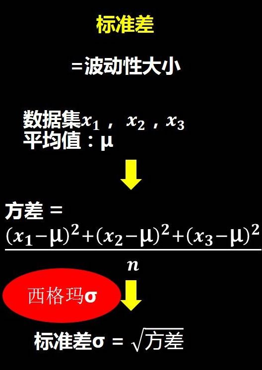

# 标准差

标准差（Standard Deviation） ，中文环境中又常称均方差，是离均差平方的算术平均数的平方根，用σ表示。  
在概率统计中最常使用作为统计分布程度上的测量。  

标准差能反映一个数据集的离散程度。  
平均数相同的两组数据，标准差未必相同。

标准差是为了描述数据集的波动大小而发明的。

## 什么是数据的波动大小？

“波动大小”可以直观的替代“离散程度”这个专业术语。  
以后遇到“离散程度”，“变异性”这些词理解不了的时候，你的大脑自动切换到“波动大小”这四个字。

## 计算公式

标准差定义是总体各单位标准值与其平均数离差平方的算术平均数的平方根，即标准差是方差的算术平方根。   

## 为啥有了标准差，还要方差？

由于方差是数据的平方，与检测值本身相差太大，人们难以直观的衡量，  
所以常用方差开根号换算回来这就是我们要说的标准差（SD）。

上述公式中 方差只不过是计算的中间过程。
你都衡量数据了，肯定要和你衡量的数据单位一致，不然比较个啥，标准差单位才是和数据一致。

## 标准差的单位是什么？标准差是大一点好，还是小一点好？

如：
最稳定的得分手 — 加内特 在本赛季所有得分过千的球员中，每场得分的标准差值最小，为4.4分。

## 样本标准差

样本标准差的意义是用于估计总体标准差。

### 样本标准差为什么 除以 n-1？

果你只是想计算一个数据集的标准差，那么就除以n。  
例如有100个毕业于清华人，想了解这100个人的收入构成的数据集的波动大小，那你就用除以n的标准差公式。

如果你想用样本来估计总体的标准差，那就用除以n-1的标准差公式。  
例如你想把刚才例子中这100个人当成一个样本，用这个样本来估计出总体（所有毕业与清华人的收入）的标准差，那么就除以n-1的标准差公式。

## 应用

金融市场中，标准差用来反映股票的波动程度。  

在NBA中，平均数据用来衡量一个球员的战斗力，比如场均得分，盖帽，抢断，助攻等。  
但衡量一个球员的稳定性，使用的是标准差。

心理测量学，智商测试。  
WAIS-RC 韦氏成人智力测验 —— 分测验量表转换为平均分100，标准差位15的离差智商。
这说明同一个群体的智商在 $[100-15,100+15]$ 这个范围内浮动。
