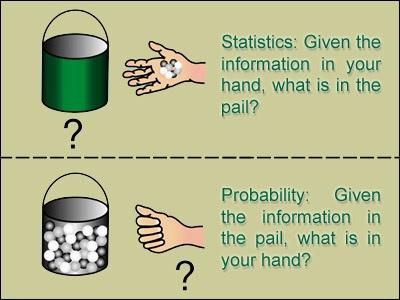

# 什么是概率论？

概率论是一门数学学科，是一套公理化的纯数学理论，  
他有严格的公理基础，里面的结论都是用严格的数学推导做出来的，如果可能的话大概全部可以转化为形式逻辑的符号语句。  

相对来说，统计学就更像一门经验科学了，它主要是对现实生活中的数据进行分析，找规律，然后预测未来走向。  

在找规律的过程中，有时候就可以用概率论的语言去描述，  
比如这一堆数据满足个什么分布，或者看上去像是某个随机过程，然后就可以用概率论的方法去处理。  

数学里更加关注的是结构，映射，以及它们的性质与关系。  
比如在一个集合有了一个特殊的拓扑结构和代数结构以后，  
比如局部紧李群，能不能在上面定义一个测度？这个测度有怎样的性质？这个测度和数学里其他的东西有怎样的联系？  
这些都是数学家关心的问题。  

## 统计学和概率论

简单来说，概率论研究的是“是什么”的问题，统计学研究的是“怎么办”的问题。  

统计学不必然用到概率论，比如用样本均值来表征总体某种特征的大致水平，这个和概率就没有关系。  
但是因为概率论研究的对象是随机现象，而统计学恰恰充满了无处不在的随机现象：因为要随机抽样。  
因此概率论就成为了精确刻画统计工具的不二法门。  

概率方向更偏数学，统计更多应用。  
很多大学里的科研，概率和统计都不是一个组（更有甚者，有的大学统计单独成立一个学院，独立于数学学院）因为大家做的东西确实不太一样。  

再举例来说，如今火热的金融数学，就属于概率方向的，大家本科的概率论只能算是最基础的课，  
其他像Stochastic Calculus，Random Model，Markov Chain，Martingale，测度论，以及一直比较火的时间序列分析等等，  
这些都是学概率方向研究的，不是数学系出身，你几乎很难入门。  
而统计则更多作为应用的科学，常见的分支有生物统计，医疗统计，经济统计等等。  

现在统计学火热一方面是如今各行各业都需要数据分析，大数据更是被吹上了天；  
另一方面统计入门门槛相对一般数学系专业更低，简单的说，非数学系要求的数据分析，用个SPSS，SAS啥的也就够了，  
但凡你学过高数，概率论，捣鼓捣鼓也没那么难理解，非数学系了解常见分布，看得懂置信区间，p-value，再来些F-test，t-test就差不多了。  
当然，数学系的统计就没这么容易了，数学系的统计常见的会研究各种分布，Bayesian统计，神经网络，金融风险，时间序列分析等等，用的软件也肯定是R居多。  

* 概率论和统计推断的区别

Larry Wasserman在他的统计学巨作All of Statistics的序言里有说过：  

  

```text
概率论是统计推断的基础，在给定数据生成过程下观测、研究数据的性质；

而统计推断则根据观测的数据，反向思考其数据生成过程。  
预测、分类、聚类、估计等，都是统计推断的特殊形式，强调对于数据生成过程的研究。
```

因此，统计和概率是方法论上的区别，一个是推理，一个是归纳。  

  

打个比方，概率论研究的是一个白箱子，  
你知道这个箱子的构造（里面有几个红球、几个白球，也就是所谓的分布函数），然后计算下一个摸出来的球是红球的概率。  

而统计学面对的是一个黑箱子，你只看得到每次摸出来的是红球还是白球，然后需要猜测这个黑箱子的内部结构，  
例如红球和白球的比例是多少？（参数估计）能不能认为红球40%，白球60%？（假设检验）  

而概率论中的许多定理与结论，如大数定理、中心极限定理等保证了统计推断的合理性。  
做统计推断一般都需要对那个黑箱子做各种各样的假设，这些假设都是概率模型，统计推断实际上就是在估计这些模型的参数。  

概率论就好比是给你一个模型，你可以知道这个模型会产生什么样的数据；  
而统计则是给你一些数据，你来判断是由什么样的模型产生的。  

    

* 再从小概率事件看看两者的关系   

概率论会说小概率事件必然发生。
因为随着试验次数的增多，该事件会发生的期望终会为1。  

统计则倾向于忽略小概率事件或者认为小概率事件不会发生。  
例如最大似然估计，估计的就是一个以假设值代替真实值的过程，  
这个过程一个自然的思想便是认为小概率不会发生，所以我们有充足的理由认为估计是可接受的。  

## 发展过程

### 起源

概率论是研究随机现象数量规律的数学分支，是一门研究事情发生的可能性的学问。  
但是最初概率论的起源与赌博问题有关。  
16世纪，意大利的学者吉罗拉莫·卡尔达诺（Girolamo Cardano）开始研究掷骰子等赌博中的一些简单问题。  

概率与统计的一些概念和简单的方法，早期主要用于赌博和人口统计模型。  
随着人类的社会实践，人们需要了解各种不确定现象中隐含的必然规律性，并用数学方法研究各种结果出现的可能性大小，从而产生了概率论，并使之逐步发展成一门严谨的学科。  
概率与统计的方法日益渗透到各个领域，并广泛应用于自然科学、经济学、医学、金融保险甚至人文科学中。  

### 发展

随着18、19世纪科学的发展，人们注意到在某些生物、物理和社会现象与机会游戏之间有某种相似性，  
从而由机会游戏起源的概率论被应用到这些领域中；同时这也大大推动了概率论本身的发展。  
使概率论成为数学的一个分支的奠基人是瑞士数学家伯努利，他建立了概率论中第一个极限定理，即伯努利大数定律，阐明了事件的频率稳定于它的概率。  
随后棣莫弗和拉普拉斯又导出了第 二个基本极限定理（中心极限定理）的原始形式。  

拉普拉斯在系统总结前人工作的基础上写出了《分析的概率理论》，明确给出了概率的古典定义，  
并在概率论中引入了更有力的分析工具，将概率论推向一个新的发展阶段。  

19世纪末，俄国数学家切比雪夫、马尔可夫、李亚普诺夫等人用分析方法建立了大数定律及中心极限定理的一般形式，  
科学地解释了为什么实际中遇到的许多随机变量近似服从正态分布。  
20世纪初受物理学的刺激，人们开始研究随机过程。这方面柯尔莫哥洛夫、维纳、马尔可夫、辛钦、莱维及费勒等人作了杰出的贡献。  

