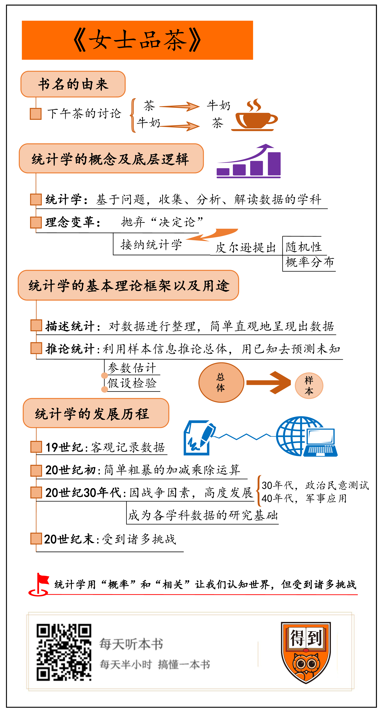

# 《女士品茶》解读

《女士品茶》这本书说的，是发生在20世纪的一场统计革命，就是这场革命，让统计学从一门默默无名的小学科，发展成了席卷整个科学界的基础工具。  

统计学就是基于问题，收集数据、分析数据、解读数据的过程。人们对统计学的接纳，同时也伴随着对“决定论”的抛弃。  
在现实生活中，统计学究竟是如何处理复杂的数据，用已知去预测未知的。  

按照不同的分析目的，统计方法可以分为描述统计和推论统计。  

描述统计主要是对数据进行整理，简单直观地呈现出数据，而推论统计则是利用样本信息去推论总体的过程，用已知去预测未知。  
描述统计和推论统计是紧密联系的，可以说，描述统计是基础，推论统计是目的，客观准确的描述为准确的推论提供了依据。  

